### 如何实现元素的水平垂直居中

### 前言

关于网页中元素的水平垂直居中的问题,对于前端的小伙伴来说,非常常见,也很重要,同时也是令人非常苦恼的,无论是面试还是笔试都是一个常见的话题,有时候,当别人问到如何让一个元素不定宽高和高,让它居中,或者有哪些水平垂直居中手段时,脑子里却想到的也就一两种,一团糟,非常尴尬,唏嘘不已,今天,我就平时的学习和使用,稍稍做了一下总结,也是对以往知识的一种回顾,跟大家分享一下使用心得,让元素在网页中水平垂直居中不在怕怕


> ### 水平居中

1. `方法1`：若是行内元素(自身不具备宽度,高度,也就是说设置宽度,高度,不起作用,由自身内容撑大,比如a,b(加粗),strong(强调),i,span,img,input,select),给其父级元素设置`text-align:center`,可以实现行内元素水平居中,示例代码如所示

`html结构代码`:文本和图片实现水平居中

    <div class="spanParent">
       	   <span>span等行内元素水平居中</span>
    </div>
    <div class="imgParent">
       	   
    </div>
`css层叠样式代码`    

    .spanParent,.imgParent{
	 	     width:100%;
	 	     text-align:center;   /*文本水平居中,给父级元素设定*/
	 	     border-bottom:1px solid #ccc;
    }
实现效果图:


2. `方法2`:若是块级元素(`div`,`p`,`ul`,`li`,`ol`,`h1-h6`,`dl`,`dt`,`dd`,`address`,`article`,`figure`,`audio`,`video`,`section`,`table`,`canvas`,`header`,`table`,`footer`)独自占一行,支持宽度和高度，要想实现水平居中:`margin:0 auto`;

`示例代码如下`:
html内容结构代码
```
<div class="box"></div>
```
css层叠样式代码

```
.box{
		width:100px;
		height:100px;
		background:yellow;
		margin:0 auto;    /*水平居中,上下,左右*/
}
```
实现效果图


3. `方法3`:若是子元素有浮动,为了让子元素水平居中,则可以让父元素宽度设置为`fit-content`,`并且配合margin:0 auto`,如下代码所示：`注意`这个属性值fit-content配上margin:0 auto才会让其水平居中,目前只有chrome,firfox,Opera浏览器支持该属性值,并且只能实现水平居中,无法实现垂直居中,`也没有height:fit-content`,该属性,即使设置了也不生效,该属性值可以实现元素收缩效果的同时，保持原本的block水平状态
如下代码示例所示:
`html结构代码`

```
<ul class="parent">
	<li>随笔川迹</li>
	<li>itclan</li>
	<li>个人简介</li>
	<li>联系地止</li>
</ul>
```
`css层叠样式代码`

```
ul,li{
	list-style:none;
}
.parent{
	width:100%;
	width:-moz-fit-content;
	width:-webkit-fit-content;
	width:fit-content;   /*父元素宽度设置fit-content,高度是没有这样的写法的*/
	margin:0 auto;     /*注意只设置得了水平居中,此方法,垂直居中无法*/
}
li{
	float:left;    /*子元素设置了浮动*/
	margin:0 5px 0;
}
```
`实现效果图示例`

具体查看属性在各个浏览器的支持程序可以访问此网站输入属性即可查看:
[can I use](https://caniuse.com)
4. `方法4` 使用flex布局,老版本:设置父元素`display:box;`(声明弹性盒模型),`box-orient:horizontal;`(父元素设置,用来确定子元素的方向,是横着的还是竖着的,horizontal是横着(水平),vertical表示竖着,垂直,),`box-pack:center;`(决定盒子内部剩余空间的对齐表现,这里是居中,均等地分割多余空间)
示例代码如下
`html结构代码`
```
<div class="parent">
       <div class="son"></div>
</div>
```
`css层叠样式代码`

```
.parent{
	/*声明弹性盒子模型*/
	display:-webkit-box;   
	/*用来确定子元素的方向,是横着的还是竖着的,horizontal是横着的*/
	-webkit-box-orient:horizontal; 
	/*决定盒子剩余空间的利用对齐方式,center表示居中*/
	-webkit-box-pack:center; 
	/*firefox*/
	display:-moz-box;
	-moz-box-orient:horizontal;
	-moz-box-pack:center;
	/*opera*/
	display:-o-box;
	-o-box-orient:horizontal;
	-o-box-pack:center;
	/*IE浏览器*/
	display:-ms-box;
	-ms-box-orient:horizontal;
	-ms-box-pack:center;
	/*标准浏览器*/
	display:box;
	box-orient:horizontal;
	box-pack:center;
}
.son{
	width:100px;
	height:100px;
	background:red;
}
```
`实现效果图示例:`


5. 方法5 使用flex,新版本:设置父元素`display:flex`(声明弹性盒模型),`flex-direction:row`(设置主轴方向为水平方向),`just-content:center`(规定主轴方向富裕空间的管理,所有子元素的居中,对应老版本的box-pack)
`示例代码所示:`
`html内容结构代码`
```
<div class="parent">
       <div class="son"></div>
 </div>
```
`css层叠样式代码`

```
 .parent{
	display:-webkit-flex;      /*声明弹性盒模型,定义弹性容器*/
	-webkit-flex-direction:row; /*row设置主轴方向为水平方向*/
	-webkit-justify-content:center; /*定义了在当前行上,弹性项目沿主轴如何排布*/
	display:flex; 
	flex-direction:row;
	justify-content:center;  /*相当于老版本的box-pack*/
}
.son{
	width:100px;
	height:100px;
	background:blue;
 }
```
`实现效果图示例`

6. `方法6` 使用css3中新增的transform属性,子元素设置离x轴50%
`html结构代码`

```
<div class="parent">
		<div class="son"></div>
</div>
```
`css结构内容代码`

```
.parent{
	position:relative;  /*相对定位*/
}
.son{
	width:100px;
	height:100px;
	background:pink;
	position:absolute;
	left:50%;
	transform:translate(-50%,0);/*设置子元素transform:translate(-50%,0)*/
}
```
`实现效果图如下示例`


7. `方法7` 元素使用绝对定位方式,以及负值的margin-left,子元素设置如下
示例代码如下所示:
`html内容结构代码`
```
<div class="parent">
	<div class="son"></div>
</div>
```
`css层叠样式结构代码`

```
.parent{
	position:relative;
}
.son{
	width:100px;
    height:100px;
	position:absolute;
	left:50%;
	margin-left:-50px; /*-宽度/2*/
	background:green;
}
```
`实例效果图如下所示`


8. `方法8` 子元素使用绝对定位方式,`position:absolute`以及`top`,`left:0`,`right:0`;`bottom:0`,属性值设置为0,`margin:0 auto`;
`html内容结构代码`
```
<div class="parent">
	<div class="son"></div>
</div>
```
`css层叠样式代码`

```
.son{
	position:absolute;  /*设置绝对定位*/
	width:100px;        /*宽度固定*/
	height:100px;
	background:#abcdef;
	top:0;
	left:0;       /*设置top | left | right | bottom都等于0*/
	right:0;
	bottom:0;
	margin:0 auto;
}
```
`实例效果图如下所示`

 
 > ### 垂直居中

1. `方法1`,若是单行文本内容,可以设置`line-height`等于父元素的高度,注意这是定高的，也就是高度是固定不变的,这种方法只适用于单行文本的元素才适用,比如块级元素里面文本,图片
`示例代码所示`
`html内容结构代码`
```
<div class="parent">
	 <span>文本垂直居中</span>
</div>
```
`css层叠样式结构代码`
```
.parent{
	width:400px;
	height:100px;
	background:red;
	line-height:100px;/*line-height:属性值==元素的高度值*/
}
```
`实例效果演示图`

`优点`:适合在所有的浏览器,但是没有足够的空间时,内容不会被切掉
`缺点`:仅仅适合应用在文本字段和图片行内元素(span,i,b,input等)身上

2. 方法2，若是行内块级元素，也就是给它设置了`display:inline-block`属性,这种方法针对一些`img`等行内元素,比较常用,`vertical-align:middle`和一个伪元素内容块处于容器的中央,`注意`要给这个伪类高度设置高度100%，此方法在IE6下失效,IE,7,8,9有用,但是又在IE10,11又失效(IEText测的)
代码实例如下所示
`html结构代码`
```
<div class="parent">
	  
</div>
```
`css层叠样式代码`

```
.parent{
	width:500px;
	height:500px;
	border:1px solid red;
}
.parent::after, .son{        /*父级元素和子元素都设置display:inline-block*/
	display:inline-block;
	vertical-align: middle;   /*设置vertical-align:middle*/
}
.parent::after{   /*父元素添加一个伪类,并且设置高度100%*/ 
	content:"";
	height:100%;
}
img{
	border:1px solid blue;
	border-left:none;
}
```
`效果实例图如下所示`

3. `方法3`,子元素可用`vertical-align:middle`(使元素垂直对齐),和`display:tab-cell`(让元素以表格形式渲染),`父元素使用display:table`,让元素以表格的形式渲染
示例代码如下所示
`html内容结构代码`
```
<div class="parent">
	 <div class="son">contentcontentcontentcontentcontentcontentcontent</div>
 </div>
```
`css层叠样式结构代码`
```
.parent{
	display:table; /*让元素以表格形式渲染*/
	border:1px solid red;
	background:red;
	height:200px;
}
.son{
	display:table-cell; /*让元素以表格的单元表格形式渲染*/
	vertical-align:middle;/*使用元素的垂直对齐*/
	background:yellow;
}
```
`实例效果如下图所示`

`优点`：
这种方法有高度的限制,此方法可以要根据元素内容动态的改变高度,是没有空间的限制,元素的内容不会因为没足够的空间而被切断或者出现滚动条
`缺点`：
适合高版本浏览器,在IE6-7下无法正常运行,结构比较复杂,常见用法在移动端布局的时候，就会用到,但是为了解决IE6-7中兼容性问题,在子元素外在套一个div,并且使用hack技术,注意父级元素得加高度
`代码示例如下所示`
`html内容结构代码如下所示`

```
<div class="parent">
		<div class="subCase">    <!---给子元素外层套一层div-->
			<div class="son">content</div>
		</div>
</div>
```
`css层叠样式代码如下所示`

```
.parent {
	height: 200px;/*高度值不能少*/
	width: 200px;/*宽度值不能少*/
	display: table;
    position: relative;
	float:left;
	background:red;
}		
.subCase {
	display: table-cell;    /*让元素以表格的形式进行渲染*/
	vertical-align: middle;			
	padding: 10px;
	*position: absolute;
	*top: 50%;
	*left: 50%;
}
.son {
	*position:relative;
	*top: -50%;
	*left: -50%;
}
```
`实例效果显示如下`

`vertical-align`属性对其`父级块级元素td,或者th时,生效`,而对于`其他块级元素,div,p,ul,li等默认情况下是不支持的`,子元素使用vertical-align,那么父级元素设置`display:table`属性,子元素设置`display:table-cell`;`vertical-align:middle`
4. 方法4,使用`Flex布局`,`display:box(声明弹性盒模型)`,`box-orient:vertical;`(父元素设置,用来确定子元素的方向,垂直方向的,竖着的,horizontal是横着的),`box-pack:center;`(决定盒子内部剩余空间的对齐表现,这里居中)
示例代码如下
`html内容结构代码`
```
<div class="parent">
		<div class="son">1</div>
</div>
```
`css层叠样式代码`

```
.parent{
	height:400px;
	display:-webkit-box;  
	-webkit-box-align:center;
	display:box;
	box-align:center;
	 border:1px solid red;
}
.son{
	width:100px;
	height:100px;
	background:yellow;
}
```
`实例效果显示如下`
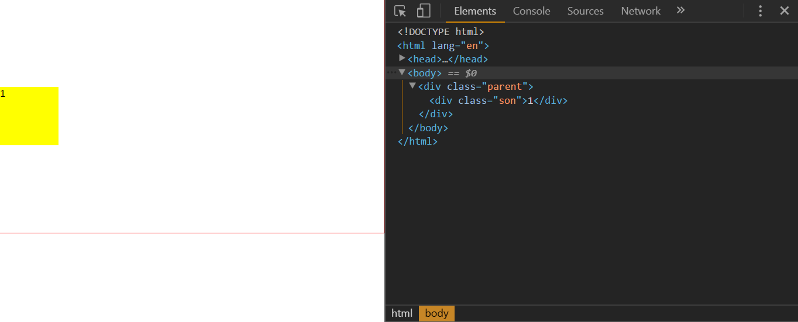
5. 方法5,使用Flex布局,`display:flex(声明弹性盒模型)`,`align-items:center`(元素在侧轴中间位置,富裕空间在侧轴两侧)`flex-direction::coluumn`(设置主轴方向为垂直方向)
`优点`：使用display:flex布局,内容块的宽高任意,优雅的溢出，可用于复杂的高级布局技术
`缺点`:IE678不支持,兼容性处理,火狐，谷歌,欧朋要浏览器前缀
`示例代码所示`

`html内容结构代码`
```
<div class="parent">
	<div class="son">1</div>
</div>
```
`css层叠样式代码`

```
.parent{
	height:400px;
	display:-webkit-flex;  
	display:flex;
	flex-direction: row;/*容器内项目的排列方向(默认横向排列),row表示沿水平主轴由左向右排列,column沿垂直主轴右上到下　*/
	align-items: center;  /*居中*/
	border:1px solid red;
}
.son{
	width:100px;
	height:100px;
	background:orange;
}
```
`实例效果如下所示`
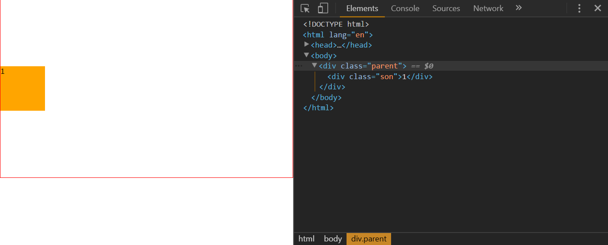
6. 方法6,设置父元素相对定位`(position:relative)`,子元素设置绝对定位`position:absolute`,`top:50%`,`height高度固定,利用margin负半值的方式`，让元素垂直居中
`html结构代码示例所示`
```
<div class="parent">
      <div class="son"></div>
</div>
```
`css结构代码`

```
.parent{
		position:relative;
		width:400px;        /*父元素设置宽度和高度*/
		height:400px;
		border:1px solid red
}
.son{
		width:100px;
		height:100px;
		position:absolute;
		top:50%;
		margin-top:-50px; /*-宽度/2*/
		background:pink;
}
```
`实例效果如下所示`
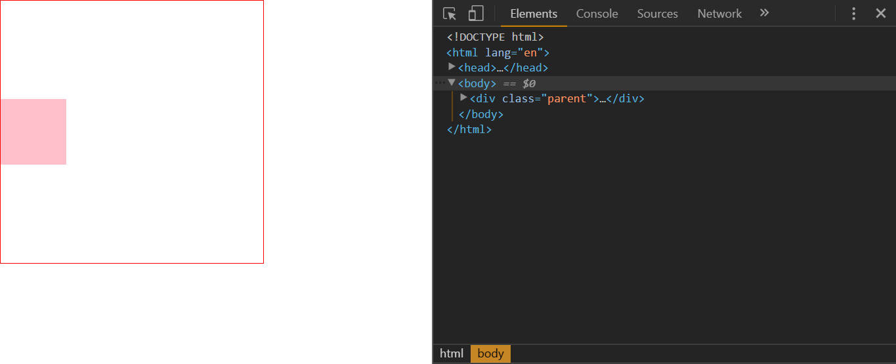

`优点`：适用于所有浏览器
`缺点`：父元素空间不够时,子元素可能不可见,当浏览器窗口缩小时,滚动条不出现时,如果子元素设置了overflow:auto,则高度不够时会出现滚动条
7. 方法7,设置父元素相对定位(position:relative),子元素设置绝对定位,margin:auto 0,高度固定,left | top | right | bottom都设置为0，但是在IE8低版本浏览器以下失效

`html内容结构代码`
```
<div class="parent">
	<div class="son"></div>
</div>
```
`css层叠样式结构代码`

```
.son{
	position:absolute;  /*设置绝对定位*/
	width:100px;        /*宽度固定*/
	height:100px;
	background:blue;
	top:0;
	left:0;             /*设置top | left | right | bottom都等于0*/
	right:0;
	bottom:0;
	margin:auto 0;
}
```
`实例效果图如下所示`
  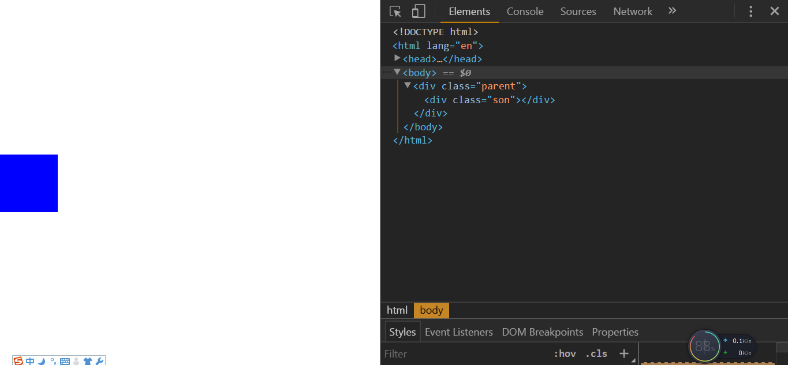

 8. 方法8,需要在`居中元素前面放一个空块级元素`(比如div)即可,然后`设置这个div的高度为50%,margin-bottom为元素高度的一半`,而且`居中元素需要清除浮动`,需要注意的是,使用这种方法,`如果你的居中元素是放在body中的话,需要给html,body设置一个height:100%的属性`
 `html结构代码如下所示`

```
 <div class="box"></div>
<div class="content">Content</div>
```
`css层叠样式`
  

```
 html,body{height:100%;}
 .box{
    	/*float:left;*/
    	height:50%;  /*相对父元素的高度的50%*/
    	margin-bottom:-120px;
}
.content{
    	clear:both;/*清除浮动*/
    	width:240px;
    	height:240px;
    	position:relative;/*只能用相对定位*/
    	background:green;
}
```
`实例效果如下所示`

`优点`:兼容所有的浏览器,在没有足够的空间下,内容不会被切掉
`缺点`:元素高度被固定死,无法达到内容自适应,如果居中元素加上overflow,要么元素出现滚动条,要么元素被切掉,另外就是一个就是加上了一个空标签
9. 方法9,此方法针对多行内容居中,而且容器高度是可变的,可以用padding值

`
html示例代码如下所示
`
```
<div class="parent">
	 <div class="son">content</div>
</div>
```
`css示例代码如下所示`

```
.son{
	padding:30px 0 30px 0;
	border:1px solid red;
}
```
`实例效果如图所示`

`缺点`:使用这种方法不能给容器固定高度,如果加了高度的话,要想要达到效果,那么要减去对应的高度

> ###水平+垂直居中

* 若是文本图片,则可以使用line-height:高度；text-align:center

`示例代码如下所示`
`html结构代码`
```
<div class="wrap">
	文本水平垂直居中显示
</div>
```
`css结构代码`

```
.wrap{
		width:400px;
		height:400px;
		text-align:center;  /*文本水平居中显示*/
		line-height:400px;  /*垂直居中显示*/
		font-size:36px;
		border:1px solid red;
}
```
`实例效果图如下所示`


* 若是定宽定高,`使用绝对定位position:absolute,left:50%,top:50%,使用margin负半值`进行元素的水平垂直居中显示,代码如下所示:
`html结构内容代码`
```
<div class="parent">
      <div class="son"></div>
</div>
```
`css示例代码如下所示`
```
 .parent{
	width:100%;
	height:500px;
	position:relative;
	background:red;
}
.son{
	width:100px;
	height:100px;
	background:pink;
	position:absolute;
	left:50%;
	top:50%;      /*top50%*/
    margin-left:-50px;/*-(元素宽度/2)*/
	margin-top:-50px; /*-(元素高度/2)*/
}
```
`实例效果如下所示`
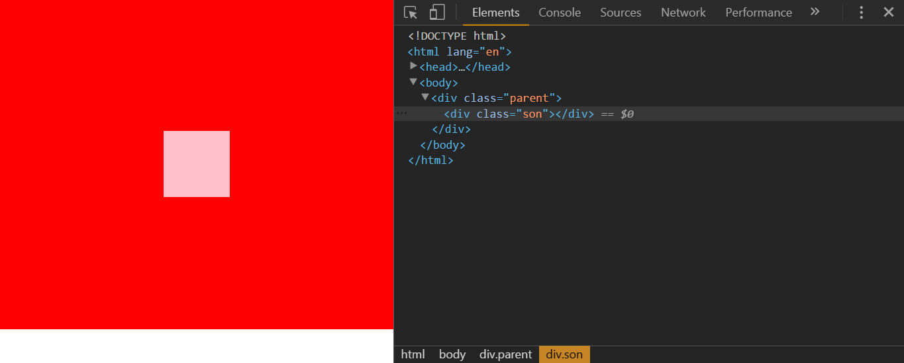
* `绝对定位absolute+margin:auto`,同时,`top:0`;`left:0`;`right:0`,`bottom:0`这种方式使一个元素水平垂直居中也是比较常见的
`html内容结构代码`
```
<div class="parent">
	<div class="son"></div>
</div>
```
`css层叠样式代码`

```
.son{
	position:absolute;  /*设置绝对定位*/
	width:100px;        /*宽度固定*/
	height:100px;
	background:#abcdef;
	top:0;
	left:0;             /*设置top | left | right | bottom都等于0*/
	right:0;
	bottom:0;
	margin: auto;      /*水平垂直居中*/
}
```
`实例效果图显示`
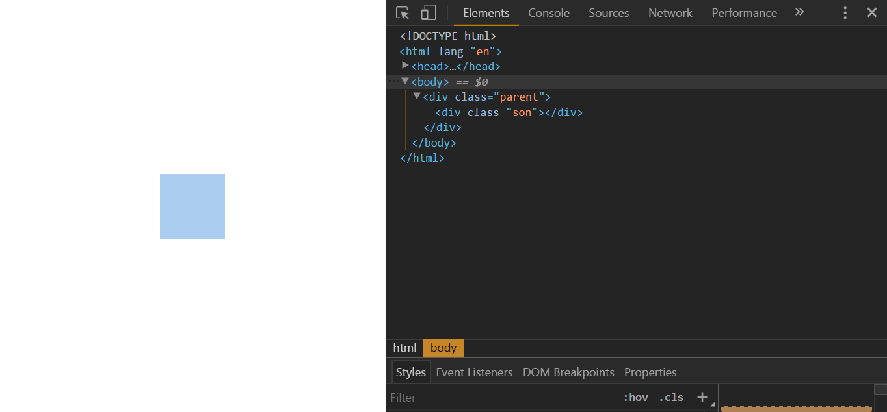
* 使用js动态计算使其元素水平垂直居中
  * 水平居中元素应设置为绝对定位,获取元素的位置,距离浏览器左边，上边的距离,并且进行赋值
  * left:(浏览器的宽度-元素的宽度)/2
  * top:(浏览器的高度-元素的高度)/2
示例代码所示

`html	内容结构代码`

```
<div id="box"></div>
```
`css示例代码`

```
 #box{
	width:100px;
	height:100px;
	background:red;
	position:absolute;  /*设置绝对定位*/
}
```
`js代码`

```
/*
* @desc 利用js控制一个元素的水平垂直居中显示
* 
*/
window.onload = function(){
  var oBox=document.getElementById("box"),
      left=(document.documentElement.clientWidth-oBox.offsetWidth)/2,
      top = (document.documentElement.clientHeight)/2;
      oBox.style.left = left+"px";
      oBox.style.top = top+"px";
  //当屏幕尺寸发生变化时
  window.onresize = function(){
	 var top = (document.documentElement.clientHeight-oBox.offsetHeight)/2,
	     left = (document.documentElement.clientWidth-oBox.offsetWidth)/2; 
	     oBox.style.top = top+"px";
		 oBox.style.left = left+"px";
  }
}
```
`实例效果如下所示`
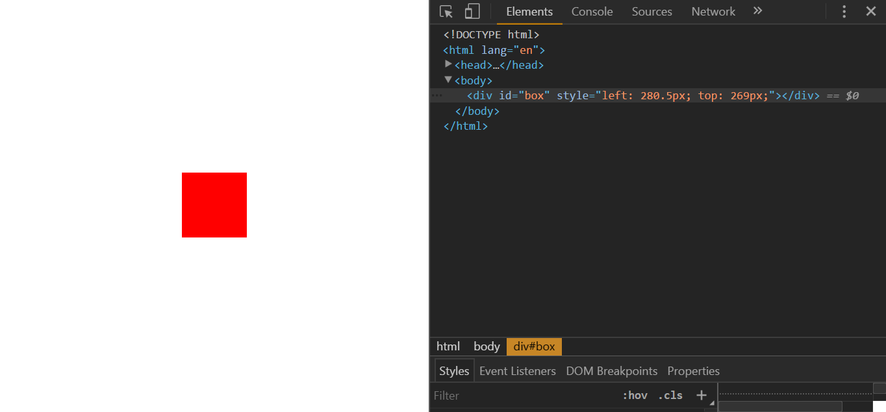
* 使用jQuery实现元素的水平垂直居中
  * 获取元素
  * 获取浏览器可视宽度$(window).width();
  * 获取浏览器可视高度$(window).height();
  * 元素距离浏览器左边的距离left:($(window).width()-元素.width())/2
  * 元素距离浏览器上边的距离top:($(window).height()-元素.height())/2
  * resize:当调整浏览器窗口的大小时，发生 resize 事件

`示例代码`
```
<div id="box"></div>
```
`css层叠样式代码`
```
 #box{
	width:100px;
	height:100px;
	background:blue;
	position:absolute;
}
```
`js代码`

```
/*
*  @dec 利用jQuery实现元素水平垂直居中
*  @function getStyle 水平垂直居中元素
*  @event resize
*/
$(function(){
 getStyle();
 function getStyle(){
   var oBox = $("#box"),
	   oW = $(window).width(),   //获取浏览器的可视宽度
	   oH  = $(window).height(), //获取浏览器的可视高度
	   l = (oW-oBox.width())/2,  // 元素距离浏览器左边的距离
	   t = (oH-oBox.height())/2; //元素距离浏览器右边的距离
	   oBox.css({                    //赋值操作,left,top值
		   left:l,
		   top:t
		});
 }
//当调整浏览器窗口的大小时,发生 resize 事件
	$(window).resize(function(){
		getStyle();
	})
})
```
`实例效果如下所示`
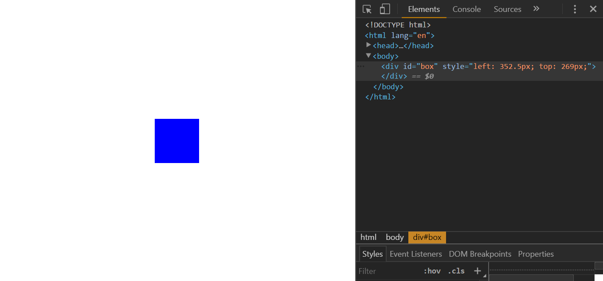

> ### 两种常见布局:圣杯布局与双飞翼布局

* 圣杯布局(左中右结构,两边宽度固定,中间自适应)
  * 左边与右边,使用绝对定位,左边left:0,top:0,右边right:0,top:0,中间使用margin
  * 两栏布局,左边侧边栏固定,右边主体自使用,左边主体自适应,右边侧边栏固定,左侧边栏固定，右主体自适应,左主体自适应,右侧边栏固定都是圣杯布局，解决办法:使用绝对定位,如上,还有就是浮动布局,弹性盒模型也可以解决
 
示例代码如下:
`使用绝对定位实现圣杯布局`
`html结构代码`
```
<div class="left">左边</div>
<div class="center">中间</div>
<div class="right">右边</div>
```
`css示例代码`

```
 .left{
	width:200px;        /*两边固定宽度,中间自适应*/
	height:600px;       /*高度可以不可,由内容填充*/
	position:absolute;
	left:0;
	top:0;
	background:red;
}
.center{
	width:100%;        /*宽度不固定*/
	background:orange;
	height:600px; 
	margin:0 200px;
}
.right{
   width:200px;       /*两边固定宽度,中间自适应*/
   height:600px;      /*高度可以不可,由内容填充*/
   position:absolute;
   right:0;
   top:0;
   background:green;
}
```
`实例效果图所下所示`
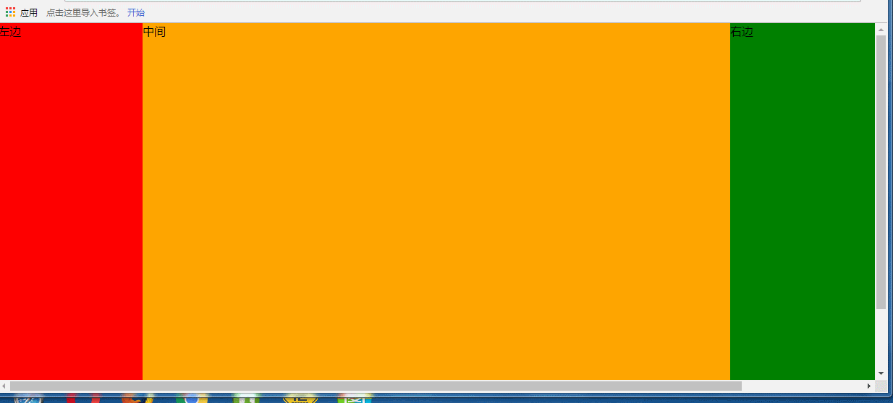
`使用浮动实现圣杯布局显示效果`
	 * 利用浮动布局
	 *  要注意位置不同,实现的效果也会不同,设置了浮动,一定要注意清除浮动
示例代码所示
`html内容结构代码`
```
<div class="left w200">左边</div>
<div class="right w200">右边</div>
<div class="center">中间</div>
```
`css层叠样式代码`

```
 .w200{
	width:200px;
	height:600px;
}
.left{
	float:left;
	background:pink;
}
.right{
	float:right;
	background:blue;
}
.center{
	height:600px;
	background:red;
	overflow:hidden;  /*清除浮动*/
}
```
`实现效果如下所示`
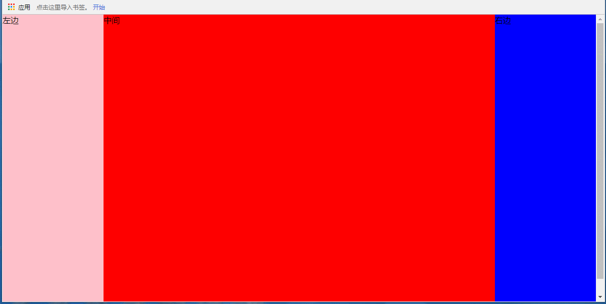
`利用弹性盒模型老版本display:box实现圣杯布局,两边固定,中间自适应`
* 当你缩放到最小值时,中间的内容会被隐藏,你可以给中间的盒子设置一个最小宽度值即可

`html结构内容代码`

```
<div class="parent">
   <div class="left w200">左边</div>
   <div class="center">中间</div>
   <div class="right w200">右边</div>
</div>
```
`css层叠样式代码`

```
.parent{
	width:100%;
	display:-webkit-box;
	-webkit-box-orient:horizontal;
	/*决定盒子剩余空间的利用对齐方式,center表示居中*/
	-webkit-box-pack:center; 
	/*firefox*/
	display:-moz-box;
    -moz-box-orient:horizontal;
	-moz-box-pack:center;
	/*opera*/
	display:-o-box;
	-o-box-orient:horizontal;
	-o-box-pack:center;
	/*IE浏览器*/
	display:-ms-box;
	-ms-box-orient:horizontal;
	-ms-box-pack:center;
	/*标准浏览器*/
	display:box;
	box-orient:horizontal;
	box-pack:center;
}
.w200{
	width:200px;
	height:600px;
}
.left{
   background:#abcdef;
}
.right{
   background:yellow;
}
.center{
	width:100%;
	background:orange;
	-webkit-box-flex:1;  /*注意的是浏览器前缀一定要加*/
	-moz-box-flex:1;
	-ms-box-flex:1;
	-o-box-flex:1;
	box-flex:1;
}
```
`实现效果图如下所示`
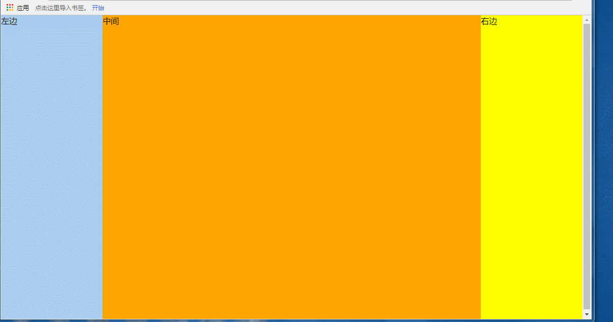
`利用弹性盒模型新版本display:flex实现圣杯布局,两边固定,中间自适应`
`html内容结构代码`
```
 <div class="parent">
    	<div class="left w200">左边</div>
	    <div class="center">中间</div>
        <div class="right w200">右边</div>
</div>
```
`css层叠样式代码`

```
.parent{
	width:100%;
	display:-webkit-flex;/*声明弹性盒模型,定义弹性容器*/
	-webkit-flex-direction:row; /*row设置主轴方向为水平方向*/
   /*决定盒子剩余空间的利用对齐方式,center表示居中*/
   -webkit-justify-content:center; /*定义了在当前行上,弹性项目沿主轴如何排布*/
   display:flex; 
   flex-direction:row;
   justify-content:center;  /*相当于老版本的flex-pack*/
   /*firefox*/
   display:-moz-flex;
   -moz-direction:row; 
   -moz-justify-content:center;
   /*opera*/
   display:-o-flex;
   -o-direction:row;
   -o-justify-content:center;
   /*IE浏览器*/
   display:-ms-flex;
   -ms-direction:row; 
   -ms-justify-content:center;
   /*标准浏览器*/
   display:flex;
   flex-direction:row;
   justify-content:center;
}
.w200{
	width:200px;
	height:600px;
 }
.left{
	background:red;
}
.right{
	background:green;
}
.center{
	width:100%;
	background:pink;
	-webkit-flex-flex:1;  /*注意的是浏览器前缀一定要加*/
	-moz-flex-flex:1;
	-ms-flex-flex:1;
	-o-flex-flex:1;
	flex-flex:1;
}
```
`实例效果图如下所示`
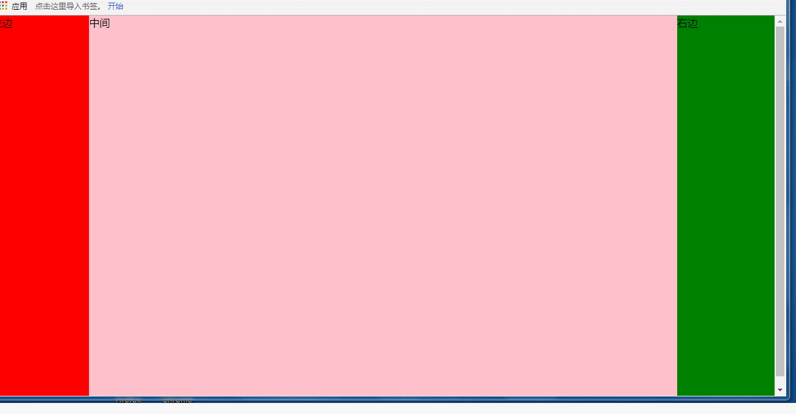

实例:手机端的淘宝布局,京东上方的搜索栏,一些后台管理系统,什么两边固定,中间自适应结构,左固定,右自适应或者左自适应,右固定等都是圣杯布局的体现,无论是使用绝对定位还是浮动布局,前两者都会破坏文档流,使用定位元素会脱离文档流,浮动会引起一些困扰的bug,比如说忘记清除浮动,设置margin-right,margin:0 auto值都会失效,在移动端布局上,使用弹性盒模型flex,无论是老版本还是新版本,对于这种两列,三列或多列自适应,复杂的布局,用flex布局方式,都是非常强大的,但是要注意兼容性,加各浏览器前缀,不然的会调试半天也会没有效果的，css的书写顺序应是选择渐进增强的方式,从低版本到高版本
比如说下面常见移动端示例参考,可借助上面的决定定位,浮动,弹性盒模型等实现下面示例上方的搜索导航部分
`京东移动端头部搜索栏部分(左中右结构,两边固定,中间自适应)`

`淘宝移动端头部搜索栏部分(左边固定,右边自适应)`

....
* 双飞翼布局(等高布局)
* 一个盒子的内容变化,同样会影响同级(兄弟)高度变换,实时同步变化
示例代码如下所示

`html内容结构代码`
```
<div class="wrap">
	<div class="left">等高布局等高布局等高布局等高布局等高布局</div>
	<div class="right">等高布局等高布局等高布局等高布局等高布局等高布局等高布局等高布局等高布局等高布局等高布局等高布局等高布局等高布局等高布局等高布局等高布局等高布局等高布局等高布局等高布局等高布局等高布局等高布局等高布局等高布局等高布局等高布局等高布局等高布局等高布局等高布局等高布局等高布局等高布局等高布局等高布局等高布局等高布局等高布局等高布局等高布局等高布局等高布局等高布局等高布局等高布局等高布局等高布局等高布局等高布局等高布局等高布局等高布局等高布局等高布局等高布局等高布局等高布局等高布局等高布局等高布局等高布局等高布局等高布局等高布局等高布局等高布局等高布局等高布局等高布局等高布局</div>
</div>
```
`css层叠样式代码`

```
.wrap{
	width:1000px;
	margin:0 auto;
	overflow:hidden;
	border:1px solid red
}
.left{
	width:300px;
	background:red;
	float:left;             /*左浮动*/
	padding-bottom:1000px;
	margin-bottom:-10000px;
}
.right{
	width:700px;
	background:blue;
	float:right;             /*右浮动*/
	padding-bottom:1000px;
	margin-bottom:-1000px;
}
```
`实例效果如下所示`
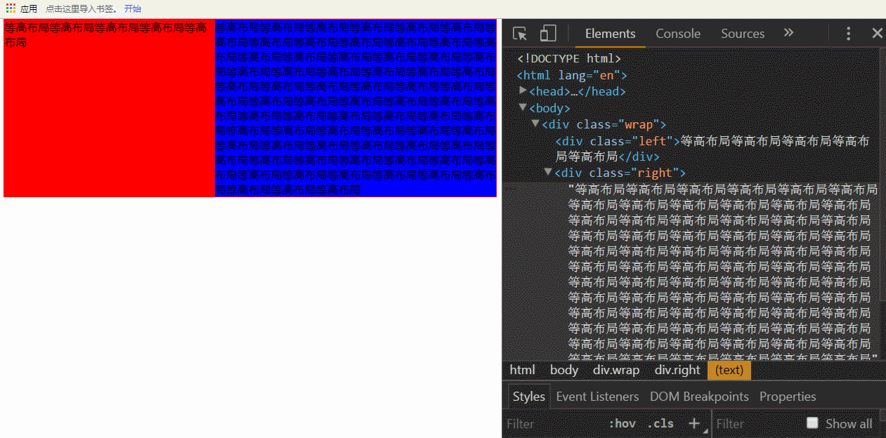

`总结`
 
 本篇主要是围绕着一个元素在页面中如何水平垂直居中,分别对行内元素和块级元素介绍了8种方式元素的水平居中和9种垂直方式元素居中,进而又对一个元素用5种方式实现水平+垂直居中显示,最终常见两种布局,圣杯布局(使用绝对定位,浮动布局,弹性盒模性Flex布局可实现)和双飞翼(等高)布局,其中绝对定位与浮动布局都会破坏元素的文档流,对于一个元素让其水平垂直居中显示很常见,比如说弹框,还有页面上布局,对于块级元素我们往往第一想到的是margin:0 auto,水平居中显示,但是有时却难以想到其他种方法,对于使用绝对定位方式,设置left,top,right,bottom为0,配合margin的使用实现水平垂直居中还是挺巧妙的,同时绝对定位,对于固定宽度高度,用margin负半值的方法实现水平垂直居中显示也是一种很好的方式,还有display:table的方式实现垂直居中显示,以及transform结合绝对定位实现元素水平居中显示,最为强大的是弹性盒模型Flex布局,无论是老版本display:box,还是新版本display:flex对父元素设置该属性,同时设置子元素的排列方式,也可以对子元素进行box-flex进行设置,能够很好的达到水平垂直居中显示,自适应,但是注意该属性的兼容性,针对不同的浏览器,要加上浏览器的前缀,否则会失效,对于元素水平垂直居中显示可以优先考虑css的方式解决(如上方法),对于复杂的实例,也可以考虑同上文中用js的方式去实现元素的水平垂直居中显示

`以下是本篇提点概要`

* 水平居中
  * `方法1`：若是行内元素,给其父级元素设置`text-align:center`,可以实现行内元素水平居中
  * `方法2`:若是块级元素,要想实现水平居中:`margin:0 auto`;
  * `方法3`:若是子元素有浮动,为了让子元素水平居中,则可以让父元素宽度设置为`fit-content`,`并且配合margin:0 auto`,`注意`这个属性值`fit-content`配上`margin:0 auto`才会让其水平居中,目前只有chrome,firfox,Opera浏览器支持该属性值,并且只能实现水平居中,无法实现垂直居中,`也没有height:fit-content`,该属性,即使设置了也不生效
  * `方法4` 使用flex布局,老版本:设置父元素`display:box;`,`box-orient:horizontal;`,`box-pack:center;`实现元素水平居中
  * . 方法5 使用flex,新版本:设置父元素`display:flex`),`flex-direction:row`(设置主轴方向为水平方向),`just-content:center`(规定主轴方向富裕空间的管理,所有子元素的居中,对应老版本的box-pack)
  * `方法6` 使用css3中新增的transform属性,子元素设置离x轴50%
  * `方法7` 元素使用绝对定位方式,left:50%,以及margin的负半值方式,margin-left:-宽度的一半
  * `方法8` 子元素使用绝对定位方式,`position:absolute`以及`top`,`left:0`,`right:0`;`bottom:0`,属性值设置为0,`margin:0 auto`;
 
* 垂直居中
  * `方法1`,若是单行文本内容,可以设置`line-height`等于父元素的高度,注意这是定高的，也就是高度是固定不变的,这种方法只适用于单行文本的元素才适用,比如块级元素里面文本,图片
  * `方法2`，若是行内块级元素，也就是给它设置了`display:inline-block`属性,这种方法针对一些`img`等行内元素,比较常用,`vertical-align:middle`和一个伪元素内容块处于容器的中央,`注意`要给这个伪类高度设置高度100%，此方法在IE6下失效,IE,7,8,9有用,但是又在IE10,11又失效(IEText测的)
  * `方法3`,子元素可用`vertical-align:middle`(使元素垂直对齐),和`display:tab-cell`(让元素以表格形式渲染),`父元素使用display:table`,让元素以表格的形式渲染
  * `方法4`,使用`Flex布局`,`display:box(声明弹性盒模型)`,`box-orient:vertical;`(父元素设置,用来确定子元素的方向,垂直方向向的,竖着的,horizontal是横着的),`box-pack:center;`
  * `方法5`,使用Flex布局,`display:flex(声明弹性盒模型)`,`align-items:center`(元素在侧轴中间位置,富裕空间在侧轴两侧)`flex-direction:coluumn`(设置主轴方向为垂直方向)
  * `方法6`,设置父元素相对定位`(position:relative)`,子元素设置绝对定位`position:absolute`,`top:50%`,`height高度固定,利用margin负半值的方式`，让元素垂直居中
  * `方法7`,设置父元素相对定位(position:relative),子元素设置绝对定位,margin:auto 0,高度固定,left | top | right | bottom都设置为0，但是在IE8低版本浏览器以下失效
  * `方法8`,需要在`居中元素前面放一个空块级元素`(比如div)即可,然后`设置这个div的高度为50%,margin-bottom为元素高度的一半`,而且`居中元素需要清除浮动`,需要注意的是,使用这种方法,`如果你的居中元素是放在body中的话,需要给html,body设置一个height:100%的属性
  * `方法9`:使用内边距的方式使其垂直居中
  
* 水平+垂直居中
   * 若是文本图片,则可以使用`line-height:高度`；`text-align:center`
   * 若是定宽定高,`使用绝对定位position:absolute,left:50%,top:50%,使用margin负半值`进行元素的水平垂直居中显示
   * `绝对定位absolute+margin:auto`,同时,`top:0`;`left:0`;`right:0`,`bottom:0`这种方式使一个元素水平垂直居中也是比较常见的
   * 使用js动态计算使其元素水平垂直居中
   * 使用jQuery实现元素的水平垂直居中
* 两种常见布局:圣杯布局(两边宽度固定,中间自适应)与双飞翼(等高)布局
    * 圣杯(两边宽度固定,中间自适应)布局
        *  使用绝对定位实现圣杯布局
        *  使用浮动实现圣杯布局
        *  使用弹性盒模型Flex布局display-box实现圣杯布局
        *  利用弹性盒模型新版本display:flex实现圣杯布局
  * 双飞翼(等高)布局
      *  一个盒子的内容变化,同样会影响同级(兄弟)高度变换,实时同步变化,如上代码示例所示
    

收听音频内容,更多精彩内容,可关注微信`itclan`公众号
